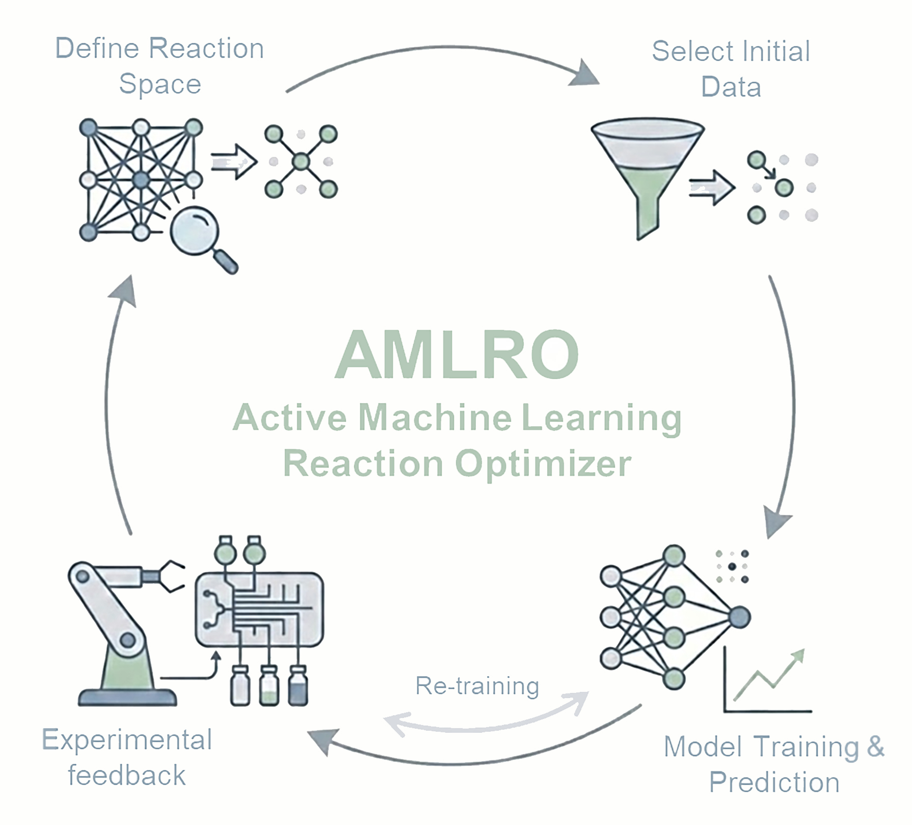

# amlro_gui

A web interface for [AMLRO](https://github.com/RxnRover/amlro) (Active Machine
Learning Reaction Optimizer) that lets a bench chemist run a full
active-learning reaction-optimization campaign: define a reaction scope,
collect initial training data, then iteratively review AI-suggested reaction
conditions, record results, and let the model retrain each cycle. No Python
required.


## Contents

- [Quick install](#quick-install)
- [Overview](#overview)
- [Architecture](#architecture)
- [Documentation](#documentation)
- [Related projects](#related-projects)
- [Citation](#citation)
- [License](#license)
- [Acknowledgments](#acknowledgments)

## Quick install

Requires Python 3.10+ and Node.js 18+. Two terminals:

```
# Terminal 1: backend
cd backend
python -m venv .venv
.venv\Scripts\python -m pip install -e ".[dev]"
.venv\Scripts\python -m flask --app amlro_gui.app run --debug
```

```
# Terminal 2: frontend
cd frontend
npm install
npm run dev
```

Open `http://127.0.0.1:5173`. Commands above are for Windows; for macOS/Linux,
installing prerequisites, or what each command does, see
[`docs/GETTING_STARTED.md`](docs/GETTING_STARTED.md).

## Overview



A reaction-optimization campaign has three phases, each with its own screen:

1. **Reaction scope**: define continuous features (bounds, resolution) and
   categorical features (allowed values) and objectives (with min/max
   direction), or upload an existing dataset instead of starting fresh.
2. **Training**: run the initial sampling plan AMLRO generates, recording an
   objective value for each condition.
3. **Prediction**: each cycle, AMLRO trains a regression model on the data
   collected so far and suggests the next batch of conditions to try. Record
   results and repeat until the campaign is stopped.

Every experiment's state is file-backed, not stored in a session cookie, so
closing the browser or restarting the app never loses progress, and past
experiments can be resumed, listed, or removed from a landing page.

<br clear="right"/>

## Architecture

- **Backend** (`backend/`): Flask, as a pure JSON API with no server-rendered
  templates, behind a thin routing layer, a Pydantic-validated schema layer,
  and a service layer that calls into AMLRO. State for each experiment is a
  `state.json` file in that experiment's own directory.
- **Frontend** (`frontend/`): React and TypeScript, built with Vite, using
  Mantine for UI components, TanStack Query for API state, and Nivo for
  charts.
- Served as one origin in production, with the built frontend as static files
  behind the Flask app.

## Documentation

- [`docs/GETTING_STARTED.md`](docs/GETTING_STARTED.md): full setup/run
  instructions (Windows, macOS, Linux) and dev commands (lint, format, test).
- [`docs/ARCHITECTURE.md`](docs/ARCHITECTURE.md): code layout, request flow,
  and how to add a new resource following the existing pattern.

## Related projects

- **[AMLRO](https://github.com/RxnRover/amlro)**: the active-learning
  reaction-optimization engine this GUI wraps. An open-source framework that
  accelerates chemical reaction optimization using active learning with
  classical machine learning regression models, combining space-filling
  sampling strategies (Sobol, Latin Hypercube) with iterative model training,
  prediction, and experiment selection. It supports multiple regression
  models, multi-objective definitions, and user-defined parameter bounds for
  data-efficient optimization from small initial datasets. This repo has no
  optimization logic of its own; every reaction-scope, training, and
  prediction computation is delegated to AMLRO.
- **[AMLRO_interface](https://github.com/dulithaprasanna/AMLRO_interface)**:
  an earlier implementation of this GUI. amlro_gui is a rewrite of it, moving
  from server-rendered templates and session-cookie state to a Flask JSON API
  and a React/TypeScript frontend.

## Citation

If you use AMLRO (the optimization engine this GUI wraps) in your work,
please cite:

> Kulathunga, D. P. et al. *RxnRover/amlro*. Computer Software. USDOE Office
> of Energy Efficiency and Renewable Energy (EERE), Advanced Materials &
> Manufacturing Technologies Office (AMMTO), 2026.
> DOI: [10.11578/dc.20260205.1](https://doi.org/10.11578/dc.20260205.1)

```bibtex
@misc{doecode_174798,
  title        = {RxnRover/amlro},
  author       = {Kulathunga, Dulitha Prasanna and Crandall, Zachery},
  doi          = {10.11578/dc.20260205.1},
  url          = {https://doi.org/10.11578/dc.20260205.1},
  howpublished = {[Computer Software] \url{https://doi.org/10.11578/dc.20260205.1}},
  year         = {2026},
  month        = {feb}
}
```

## License

MIT License. Copyright 2026, Iowa State University. See
[`LICENSE`](LICENSE) for the full text, including U.S. Government rights
under contract DE-AC02-07CH11358 for Ames National Laboratory.

## Acknowledgments

Developed with the assistance of Claude Code, Anthropic's AI coding
assistant.
